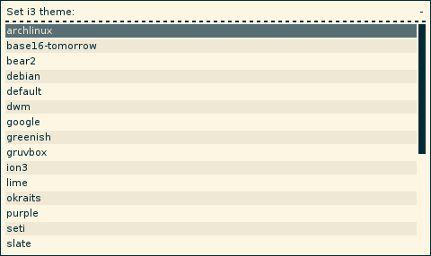

## i3configs

Currently deprecated due to the addition of the include directive in i3 v4.20. Archiving this repo.

https://i3wm.org/docs/userguide.html#include

#### Config templater for i3

### Overview

A generalization of the original j4-make-config script which uses the conceptual 
model of *config blocks*, pieces of a configuration file that can be plugged into some other file. 
This lends itself nicely to a usecase where i3 is used in different environments and some tweaks need 
to be made in each one while preserving movement and personal tweak configuration settings. 

By default this script edits your i3 config file; it can back it up for you automatically if you're paranoid 
(and you should always be paranoid). There (should be) an option to have a "source" config file which is 
compiled into the final product *ala* the original j4-make-config.

### Rofi Interactivity
Straight-out taken from j4-make-config and accessed using -i/-\-interactive.

### Requirements

i3configs has requirements but I haven't actually looked into them. So don't worry about it.

- Python 2 or 3
- rofi (optional - to choose a theme in interactive mode)
- xsetroot (optional for setting the root window background)

### Usage

I'll need to do this.

### Installation

Also need to do this. What, a setup.py right?

### License

#### Copied from j4-make-config

This software is released under the terms of the
GNU General Public License v2:

[http://www.gnu.org/licenses/old-licenses/gpl-2.0.txt](http://www.gnu.org/licenses/old-licenses/gpl-2.0.txt)

The theme files are either ports of themes from other window managers,
assembled from i3 configurations found on the net or original themes
done by various people. I do not have any copyright for them except when
stated differently.
